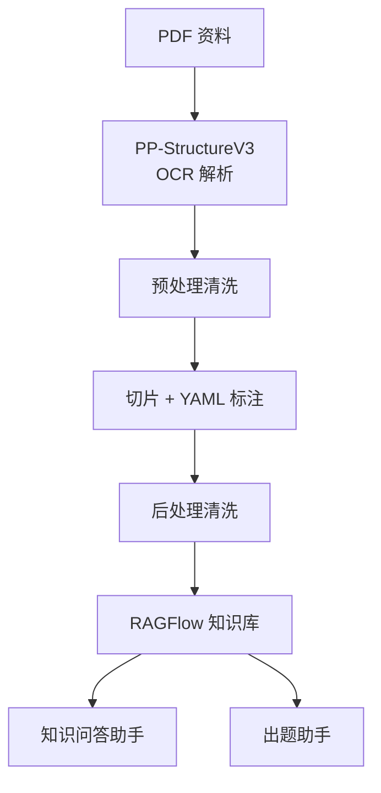

# 考试复习 RAG 系统

将 PDF 考试复习材料转化为 RAGFlow 知识库，构建 AI 辅助备考助手——支持智能问答和自动出题。

## 功能

- **PDF → Markdown**：PP-StructureV3 (PaddleOCR GPU) 逐页解析，表格输出 HTML，公式输出 LaTeX
- **智能切片**：按标题切分，注入 YAML 元数据，父级上下文追踪，三重检索优化
- **RAGFlow 知识库**：Docker 部署，按知识域分库，Hybrid Search（向量 + BM25）+ Reranker 精排
- **知识问答助手**：知识点查询、ITO 检索、计算题逐步解析、案例分析、论文框架
- **出题助手**：随机出题、指定题型/知识域、答题核对 + 解析

## 架构



详见 [系统架构](docs/architecture.md)。

## 快速开始

### 1. 环境准备

```bash
# 克隆仓库
git clone https://github.com/fortitudolucifer/exam-rag-system.git
cd exam-rag-system

# 创建 Python 虚拟环境
python -m venv .venv
.\.venv\Scripts\activate

# 安装依赖
pip install -r requirements.txt
```

PP-StructureV3 需要 PaddlePaddle GPU，安装指南见 [docs/ocr-setup.md](docs/ocr-setup.md)。

### 2. 运行 Demo

本仓库内置一套 demo 数据（软考办官方公开 PDF），可端到端验证流水线：

```bash
# ① OCR 解析
python scripts/ppstructv3_parse.py --input demo/raw

# ② 预处理
python scripts/preprocess_ppstructv3.py --apply

# ③ 切片 + 标注
python scripts/slice_and_tag.py --input ppstructv3_out/markdown_cleaned --map demo/domain_map.json --force --clean

# ④ 后处理
python scripts/postprocess_chunks.py --apply

# ⑤ 质量检查
python scripts/quality_check.py
```

详见 [demo/README.md](demo/README.md)。

### 3. 部署 RAGFlow

```bash
# Docker 部署 RAGFlow
cd <ragflow-path>/docker
docker compose up -d
```

部署指南见 [docs/ragflow-deploy.md](docs/ragflow-deploy.md)。

### 4. 上传知识库 + 配置助手

```bash
python scripts/upload_to_ragflow.py --api-key YOUR_API_KEY --all
```

Assistant 配置见 [docs/assistant-config.md](docs/assistant-config.md)。

## 项目结构

```
.
├── scripts/                # 处理流水线脚本
│   ├── ppstructv3_parse.py       # PDF → Markdown（PP-StructureV3）
│   ├── preprocess_ppstructv3.py  # OCR 输出清洗
│   ├── slice_and_tag.py          # 切片 + YAML 标注
│   ├── postprocess_chunks.py     # 后处理（去噪/去广告/修空格）
│   ├── upload_to_ragflow.py      # 批量上传 RAGFlow
│   ├── quality_check.py          # 质量检查
│   ├── organize_raw.py           # 原材料整理
│   ├── check_ocr_need.py         # OCR 需求检测
│   ├── split_textbook.py         # 大 PDF 拆章
│   └── chapter_domain_map.json   # 文件名→知识域映射
├── demo/                   # 可运行 demo（公开 PDF）
│   ├── raw/                      # 3 个软考办官方公开 PDF
│   ├── domain_map.json           # demo 专用映射
│   └── README.md
├── docs/                   # 文档
│   ├── architecture.md           # 系统架构
│   ├── pipeline.md               # 处理流水线
│   ├── ocr-setup.md              # OCR 环境安装
│   ├── ragflow-deploy.md         # RAGFlow 部署
│   ├── assistant-config.md       # Assistant 配置
│   ├── usage-guide.md            # 使用指南
│   └── troubleshooting.md        # 故障排查
├── requirements.txt        # Python 依赖
├── .env.example            # 环境变量模板
└── LICENSE                 # Apache 2.0
```

## 技术栈

| 层 | 技术 |
|----|------|
| OCR | PP-StructureV3 (PaddleOCR 3.4.0 + PaddlePaddle GPU 3.2.2) |
| PDF 渲染 | PyMuPDF 1.27 |
| RAG 引擎 | RAGFlow v0.24.0 (Docker) |
| 向量检索 | Elasticsearch + Qwen3-Embedding-4B |
| 精排 | Qwen3Reranker4B |
| LLM | 可选（通义千问 / DeepSeek / OpenAI 兼容等） |

## 核心特性

### OCR 质量对比

经过三种方案实测，PP-StructureV3 在中文考试材料上表现最优：

| 方案 | 准确率 | 表格 | 公式 | OOM |
|------|--------|------|------|-----|
| Tesseract | ~90% | 损坏 | 丢失 | 无 |
| Docling + RapidOCR | ~98% | 压成一行 | 占位符 | 有 |
| **PP-StructureV3** | **~99%** | **结构化 HTML** | **LaTeX** | **无** |

### Chunk 检索优化

基于 Anthropic Contextual Retrieval 策略：

- 正文以 H2 标题开头（BM25 关键词锚点）
- YAML 仅保留中文字段（chapter + section）
- 父级上下文注入（子标题自动追踪父级主题）
- 文件名含父级 slug（来源可读性好）

### 踩坑记录

项目中踩过的坑和解决方案已整理在 [docs/troubleshooting.md](docs/troubleshooting.md)，包括：

- RAGFlow 两套 API 导致的零召回 Bug
- `meta_data_filter: auto` 干扰检索
- `prompt_config` 缺字段导致 KeyError
- `top_n` 参数对比测试（4 vs 6 vs 8）

## License

[Apache License 2.0](LICENSE)

## 致谢

- [RAGFlow](https://github.com/infiniflow/ragflow) - 开源 RAG 引擎
- [PaddleOCR](https://github.com/PaddlePaddle/PaddleOCR) - PP-StructureV3 OCR
- [Anthropic Contextual Retrieval](https://www.anthropic.com/news/contextual-retrieval) - Chunk 优化策略
