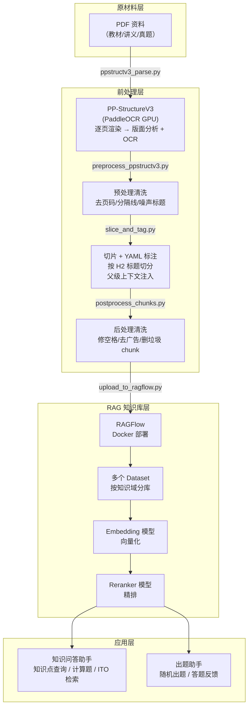

# 系统架构

## 概述

本项目将 PDF 格式的考试复习材料（教材、讲义 PPT、真题等）转化为 RAGFlow 知识库，构建 AI 辅助备考助手。核心流程：**PDF → OCR → Markdown → 切片标注 → RAGFlow 知识库 → 智能问答 / 出题自测**。

## 架构图



## 组件说明

### 前处理层

| 组件 | 作用 | 输出 |
|------|------|------|
| PP-StructureV3 | PDF 逐页渲染为 PNG → 版面分析 + OCR + 表格识别 + 公式识别 | Markdown（含 HTML 表格 + LaTeX 公式） |
| 预处理脚本 | 清洗 OCR 噪声（页码注释、分隔线、水印标题、浮动文字） | 干净的 Markdown |
| 切片脚本 | 按 H2 标题切分为独立 chunk，注入 YAML 元数据 | 带元数据的 .md chunk 文件 |
| 后处理脚本 | 修复汉字间空格、统一括号、删除广告/乱码/垃圾 chunk | 最终可上传的 chunk |

### RAG 知识库层

| 组件 | 作用 |
|------|------|
| RAGFlow | 开源 RAG 引擎，Docker 部署，提供 Web UI 和 API |
| Dataset | 按知识域分库（如进度管理、成本管理、风险管理等） |
| Embedding | 将 chunk 文本转为向量，用于语义检索 |
| Reranker | 对候选 chunk 精排，提升检索精度 |

### 应用层

| 助手 | 功能 |
|------|------|
| 知识问答助手 | 知识点查询、ITO 三要素检索、计算题逐步解析、案例分析不足点、论文框架 |
| 出题助手 | 随机出题、指定题型/知识域出题、答题核对 + 解析 |

## 检索机制

RAGFlow 采用 **Hybrid Search**（混合检索）：

```
final_score = vector_similarity × W + bm25_score × (1 - W)
```

- **向量检索**：Embedding 模型将 chunk 转为向量，语义相似度匹配
- **BM25 检索**：关键词倒排索引，精确匹配考试术语
- **Reranker**：对 top_k 个候选精排，取 top_n 送入 LLM

推荐参数（经实测验证）：

| 参数 | 推荐值 | 说明 |
|------|--------|------|
| `vector_similarity_weight` | 0.5 | 向量与 BM25 各占 50% |
| `similarity_threshold` | 0.12 | 低阈值保证召回率 |
| `top_k` | 100-200 | 候选 chunk 数（送 Reranker），本地部署可调高 |
| `top_n` | 6 | 最终送入 LLM 的 chunk 数 |
| `temperature` | 0.1 | 低随机性，计算题答案稳定 |

## 知识域划分

按考试知识域分库，便于管理和检索：

| Dataset | 覆盖内容 |
|---------|---------|
| `kb_schedule` | 进度管理 |
| `kb_cost` | 成本管理 |
| `kb_risk` | 风险管理 |
| `kb_scope_quality` | 范围 + 质量管理 |
| `kb_procurement` | 采购管理 |
| `kb_integration` | 整合 / 综合管理 |
| `kb_resource_comm_stakeholder` | 资源 / 沟通 / 干系人 |
| `kb_informatization` | 信息化基础 |
| `kb_calculation` | 计算专题（挣值/PERT/关键路径等） |
| `kb_case_analysis` | 案例分析讲义 |
| `kb_case_history` | 历年案例真题讲解 |
| `papers_20XX` | 近年真题 |
| `kb_essay` | 论文写作 |
| `ref_books` | 辅导书 |
| `kb_textbook` | 教材 |

> 知识域划分可根据实际材料调整，`scripts/chapter_domain_map.json` 定义文件名到知识域的映射。
